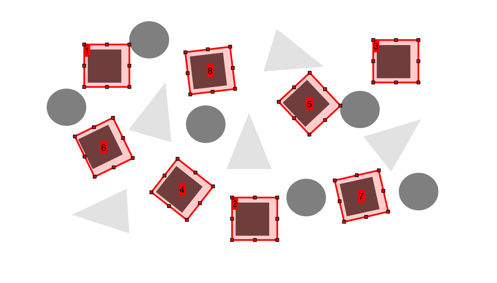

# 3-Shear Template Matching

This repository houses an implementation of the 3-shear Fourier transform template matching method proposed by Marvin Chandra Wijaya in their paper titled [Template Matching Using Improved Rotations Fourier Transform Method](https://doaj.org/article/d353c7f753fc4482a1bb3a07804b520b). The purpose of this method in the context of digital image processing is to identify and localize a given template image within an original image.

A major drawback of simple template matching, traditionally performed through normalized correlation between template and original image, is that the scale and rotation of the template matters significantly. If the scale or rotation of the template within the image does not match that of the template image, then there will be poor matching. Wijaya's template matching method combats this problem by template matching multiple times, each time with the template image rotated slightly to account for all possible rotations of the template within the original image. Rotating an image while maintaining its quality is a suprisingly difficult task; therefore, Wijaya uses a series of shear transformations to rotate the template while maintaing its quality as to maintain matching accuracy. 

As previously mentioned, traditional template matching is performed through normalized correlation between template and original image. The template matching method implemented here performs this correlation in the frequency domain using the Fourier transform to transform the signals and multiplcation to perform the correlation.

Example template matching result of the template matching methods implemented in this repository can be seen in the figure below. Where the base image was an image full of shapes, and the template was a square.

The work in this repository is done as a research project for the University of New Brunswick's EE6553 Fundamentals of Digital Image Processing.

Author: Ethan Garnier